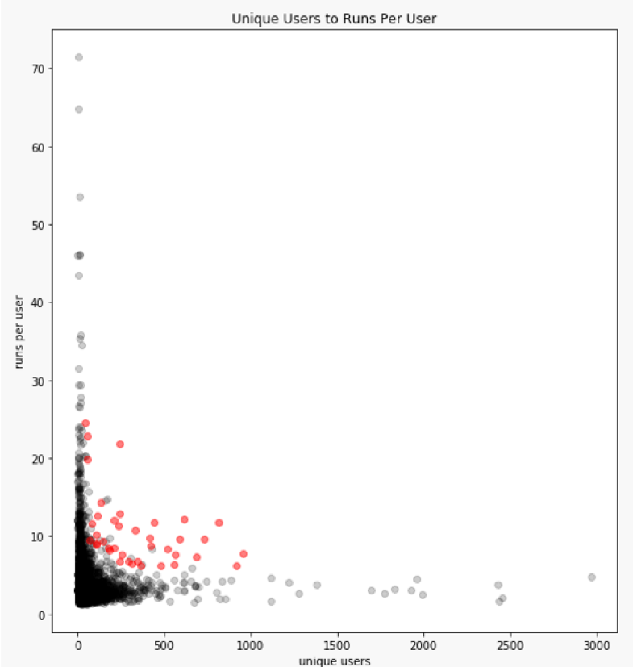

# Notebook review system

In early 2019, we added a system for peer review of notebooks.  In an enterprise environment, there may be users who only run notebooks that other people have written.  One of the goals of nbgallery is to give users confidence that a notebook they discover will work properly.  Our [health monitoring](https://nbgallery.github.io/health_paper.html) generates a score based on automatic measurements; in contrast, peer review provides a subjective evaluation from an expert or power user within the system.

## Types of review

There are three different types of review: technical, functional, and compliance.  Each can be individually enabled in [settings](../config/settings.yml) can be labeled with a different string in the UI if desired.

Technical review is intended to be a lightweight code review by someone experienced with writing code in general and notebooks in particular.  This might include things like proper use of APIs and libraries, coding style, efficient algorithms, etc.

Functional review is intended to assess whether the notebook does what the author says it does.  Does the notebook use appropriate datasets?  Is the methodology correct?  The functional review should likely be performed by someone with domain expertise and experience with the Jupyter platform.

Compliance review is intended for organizations where data analysis is subject to specific rules and polices -- think HIPAA in the health care industry.

## Review workflow

The review process starts in the review queue.  Notebook authors can submit their own notebooks to be reviewed, or a recommender may automatically queue high-value notebooks based on system metrics.  Here's an graph that shows notebook usage where the red dots indicate notebooks that were queued up based on being identified as high-value ([here's the code](https://github.com/nbgallery/nbgallery/blob/master/app/models/review.rb#L85) that determines high-value notebooks).

Notebooks in the review queue can be "claimed" by any nbgallery user that meets the qualifications for that review type. For example, here's a notebook that has been queued up for code review with the top 10 authors who were best matched the perform that review given the option to claim it.

The reviewer can communicate with the author offline or through nbgallery's commenting or feedback mechanisms.  The reviewer then adds his comments and marks the review completed.

If [revision tracking](revisions.md) is enabled as in the screen shots above, reviews will be linked to a specific revision.  Notebooks can be reviewed multiple times as they change.
